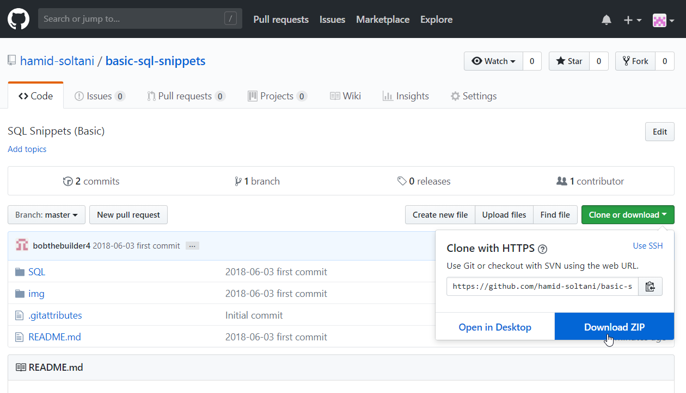
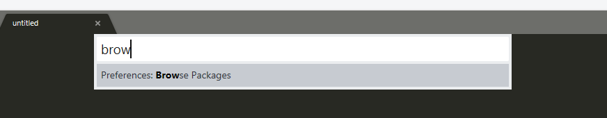
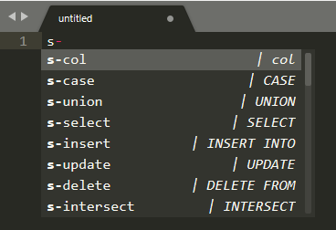

Basic SQL Snippets for Sublime Text

## Download

* [download](https://github.com/hamid-soltani/basic-sql-snippets) `*.zip` file



* or you can use [git](https://git-scm.com/)
```bash
cd %HOMEPATH%\Downloads
git clone https://github.com/hamid-soltani/basic-sql-snippets.git
```

## Install (Windows Only)

you have two choises `Graphical` or `Using cmd`

#### Graphical

1. `Ctrl+Shift+p`
2. Type: "browse" and then press `Enter` - windows explorer will open



3. Enter `User/` folder
4. Create new folder `SQL/`
5. Move all `*.sublime-snippet` into the `SQL/` folder
6. Reload `Sublime Text` (i.e. Close and Open again Sublime Text)

#### Using cmd

1. Go to
```bash
cd "%APPDATA%\Sublime Text 3\Packages\User"
```

2. Create new folder `SQL/`
```bash
mkdir SQL
```

3. Move or copy all `*.sublime-snippet` into `SQL\` folder (Just created)
```bash
# Let's assume that your (*.sublime-snippet) files are into Downloads/SQL folder
move "%HOMEPATH%\Downloads\basic-sql-snippets\SQL\*.sublime-snippet" SQL\
```

## Usage
1. Create new file into `Sublime Text`
2. `Ctrl+Shift+p`
3. Type: "SQL" - to set sql syntax
4. **Just type: `s-`** an then `Ctl+Space` to autocomplete - you'll get a list



> Note: `s` stands for SQL

## Snippets list (by category)

#### Theoric

tabTrigger | Description
-|-
s-info-CR | Informations
s-functions-CR | Useful functions

#### DML (Data Manipulation Language) - SELECT, INSERT, UPDATE and DELETE

tabTrigger | Description
-|-
s-select | SELECT
s-select-group-by | SELECT ... GROUP BY
s-select-join2 | SELECT JOIN 2 tables
s-select-join3 | SELECT JOIN 3 tables
s-select-operateurs-ensembliste-CR | UNION, EXCEPT, INTERSECT
s-select-sous-requetes-CR | SELECT ... SELECT
s-insert | INSERT INTO
s-insert-from-select | INSERT INTO .. AS (select)
s-update | UPDATE
s-delete | DELETE FROM

#### DDL (Data Definition Language) - CREATE, ALTER, TRUNCATE, DROP et RENAME

tabTrigger | Description
-|-
s-create-alter-sequence | CREATE SEQUENCE ...
s-create-index | CREATE INDEX .. ON ..
s-create-synonym | CREATE SYNONYM .. FOR ..
s-create-table | CREATE TABLE ..(..)
s-create-view | CREATE VIEW .. AS ..
s-alter-table-add | ALTER TABLE .. ADD ..
s-alter-table-alter-modify | ALTER TABLE .. ALTER COLUMN ..
s-alter-table-drop-column-constraint | ALTER TABLE .. DROP COLUMN ..
s-drop-index | DROP INDEX ..
s-drop-sequence | DROP SEQUENCE ..
s-drop-synonym | DROP SYNONYM ..
s-drop-table | DROP TABLE ..
s-drop-view | DROP VIEW ..

#### Columns

tabTrigger | Description
-|-
s-col | col
s-col-check | col CHECK
s-col-default | col DEFAULT
s-col-default-sequence | col SEQUENCE ...
s-constraint-chk | CONSTRAINT .. CHECK(..)
s-constraint-fk | CONSTRAINT .. FOREIGN KEY (..) REFERENCES tab(..)
s-constraint-pk | CONSTRAINT .. PRIMARY KEY(..)
s-constraint-un | CONSTRAINT .. UNIQUE(..)

#### CASE Structure

tabTrigger | Description
-|-
s-case | CASE
s-case-if-else-style | CASE IF ELSE ...

#### Set operations (Opérations ensemblistes)

tabTrigger | Description
-|-
s-except-minus | EXCEPT or MINUS
s-intersect | INTERSECT
s-union | UNION

T-SQL

tabTrigger | Description
-|-
s-t-sql-insert-100000-lignes | T-SQL insert 100000 lignes

#### DCL (Data Control Language) - GRANT et REVOKE

Used to create (roles, permissions, and referential integrity as well) it is used to control access to database by securing it.

> Use SQL Server Management Studio (SSMS)

#### TCL (Transactional Control Language) - COMMIT, ROLLBACK

Used to manage different transactions occurring within a database.

> Just type, COMMIT or ROLLBACK -- very easy